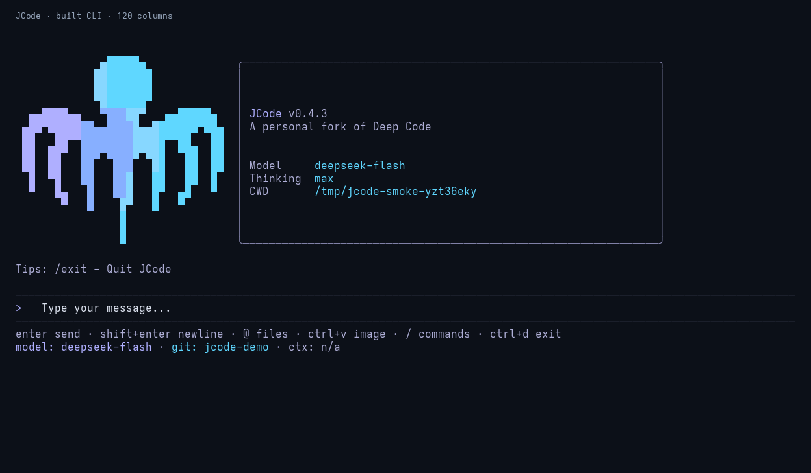

# JCode

JCode 是 [Deep Code](https://github.com/lessweb/deepcode-cli) 的个人 fork，采用 SPECTRE 终端标志、紫色/青色主题和精简的会话状态栏。保留原有 MIT 许可证和版权声明。

[English](README-en.md) · 中文

## 本地安装

需要 Node.js 22 或更高版本。此 fork 尚未发布到 npm，请从源码构建并使用独立安装前缀：

```bash
git clone https://github.com/JanBanasik/deepcode-cli.git JCode
cd JCode
npm ci
npm run check
npm test
npm run build
npm install --global --prefix "$HOME/.local/share/jcode" ./packages/cli --ignore-scripts
export PATH="$HOME/.local/share/jcode/bin:$PATH"
jcode --version
jcode --help
```

JCode 与上游共享 `~/.deepcode/settings.json`、项目 `.deepcode/settings.json` 和会话存储，不迁移现有配置。`DEEPCODE_*` 环境覆盖继续有效。Internal workspace packages, VSCode command IDs, and the `deepcode-self-refer` skill identifier retain their upstream names to preserve imports and existing settings.



SPECTRE 标志来自 James Bond；终端图案参考 [DPMA 的示例](https://www.dpma.de/dpma/veroeffentlichungen/hintergrund/dasallalles/jamesbond/index.html)。

## 配置

创建 `~/.deepcode/settings.json` 文件，内容如下：

```json
{
  "env": {
    "MODEL": "deepseek-flash",
    "BASE_URL": "https://api.deepseek.com",
    "API_KEY": "sk-..."
  },
  "thinkingEnabled": true,
  "reasoningEffort": "max"
}
```

配置文件与[上游 Deep Code VSCode 插件](https://github.com/lessweb/deepcode-cli)共享，无需重复配置。

完整配置说明（多层级优先级、环境变量等）请参阅 [docs/configuration.md](docs/configuration.md)。

## 主要功能

### **Skills**
JCode 支持 agent skills，允许您扩展助手的能力：

Skills 会按以下优先级扫描：

| Scope   | Path                  | Purpose                       |
| :------ | :-------------------- | :---------------------------- |
| Project | `./.deepcode/skills/` | JCode 原生位置            |
| Project | `./.agents/skills/`   | 跨客户端互操作                |
| User    | `~/.deepcode/skills/` | JCode 原生位置            |
| User    | `~/.agents/skills/`   | 跨客户端互操作                |

### **为 DeepSeek 优化**
- 专门为 DeepSeek 模型性能调优。
- 通过使用[上下文缓存](https://api-docs.deepseek.com/guides/kv_cache)来降低成本。
- 原生支持[思考模式](https://api-docs.deepseek.com/guides/thinking_mode)和思考强度控制。

## 斜杠命令与按键功能

| 斜杠命令        | 操作                               |
|-------------|----------------------------------|
| `/`         | 打开 skills / 命令菜单                 |
| `/new`      | 开始新对话                            |
| `/resume`   | 选择历史对话继续                         |
| `/fork`     | 从当前对话创建独立的新会话                    |
| `/continue` | 继续当前对话，或选择历史对话恢复                 |
| `/model`    | 切换模型、思考模式和推理强度                   |
| `/raw`      | 切换显示模式（Normal / Lite / Raw 滚动回溯） |
| `/init`     | 初始化 AGENTS.md 文件                 |
| `/skills`   | 列出可用 skills                      |
| `/mcp`      | 查看 MCP 服务器状态和可用工具                |
| `/undo`     | 将代码和/或对话恢复到之前的状态                 |
| `/exit`     | 退出（也可用连续 `Ctrl+D`）               |

| 按键            | 操作                 |
|---------------|--------------------|
| `Enter`       | 发送消息               |
| `Shift+Enter` | 插入换行（也可用 `Ctrl+J`） |
| `Ctrl+V`      | 从剪贴板粘贴图片           |
| `Esc`         | 中断当前模型回复           |
| 连续 `Ctrl+D`   | 退出                 |

## 支持的模型

- `deepseek-flash`（推荐使用）
- `deepseek-v4-pro`
- `deepseek-v4-flash`
- `deepseek-v4-flash-vision-exp`
- 任何其他 OpenAI 兼容模型

## 架构和基准测试

Armin Ronacher 在[《Better Models: Worse Tools》](https://lucumr.pocoo.org/2026/7/4/better-models-worse-tools/)中指出，工具 schema 不是「中立的」：模型（LLM）会继承训练和强化学习中形成的工具使用习惯，因此可能在某个主流 harness 中表现很好，却在另一套工具形态下变得不稳定。这正是 JCode 的架构出发点：只为 DeepSeek 量身调优，从而让 harness 本身持续贴合 DeepSeek 的行为特点。

上游 Deep Code 的收益来自于工具约束、上下文管理、Agent Skills 和权限策略等多项设计叠加后的结果。[deepcode-qrcode-benchmark](https://github.com/qorzj/deepcode-qrcode-benchmark) 项目展示了在一个真实且有难度的 Python 需求上，Deep Code + DeepSeek + `/plan` 模式相较 Claude Code + DeepSeek 的组合具有效果优势。

> 详见：[JCode 架构](docs/architecture.md)

## 常见问题

### JCode 是否支持子代理？

JCode 尚不支持原生子代理的启动和管理。Agent Skills 提供可复用的指令，MCP 连接外部工具，`/fork` 创建会话分支。后台 Bash 任务是 Shell 进程；内置工具调用目前按顺序执行。原生子代理功能记录在 [issue #9](https://github.com/JanBanasik/deepcode-cli/issues/9)。

### JCode 是否有 VSCode 配套插件？

本仓库包含 JCode VSCode 配套插件，并兼容已发布的[上游 Deep Code 插件](https://marketplace.visualstudio.com/items?itemName=vegamo.deepcode-vscode)。它们与 CLI 共享 `~/.deepcode/settings.json` 配置。JCode 尚未单独发布到 Marketplace。

### JCode 是否支持理解图片？

支持。`deepseek-flash` 模型支持直接读取本地图片或使用`ctrl+v`从剪贴板粘贴图片，让模型直接看到图片内容。

`deepseek-v4-pro`、`deepseek-v4-flash` 等非多模态模型仍会使用 `UnderstandImage` 识图工具。JCode 会自动判断模型能力，也可通过 `multimodal` 配置项手动覆盖。

默认情况下，图片会以 base64 内联发送给模型。启用 `filesApiEnabled` 后，JCode 会使用 DeepSeek Files API 上传图片并在请求中复用 `file_id`。详见 [docs/configuration.md](docs/configuration.md#deepseek-files-api)。

### 怎样在任务完成后自动给 Slack 发消息？

编写一个调用 Slack webhook 的 Shell 通知脚本，然后在 `~/.deepcode/settings.json` 中将 `notify` 字段设为该脚本的完整路径即可。详细步骤请参考 [docs/notify.md](docs/notify.md)。

### 怎样启用联网搜索功能？

JCode自带免费的、且大部分情况够用的Web Search工具。如果你希望使用自定义脚本进行联网搜索，可以在 `~/.deepcode/settings.json` 中将 `webSearchTool` 设为脚本的完整路径即可。详细步骤可参考：https://github.com/qorzj/web_search_cli

### 如何配置 MCP？

JCode 支持 MCP（Model Context Protocol），可以连接 GitHub、浏览器、数据库等外部服务。在 `settings.json` 中配置 `mcpServers` 字段即可启用，启动后使用 `/mcp` 命令查看已配置的 MCP 服务器状态和可用工具。

详细配置指南：[docs/mcp.md](docs/mcp.md)

### 如何配置 JCode 任务完成后发送通知？

当 AI 助手完成一轮任务后，JCode 可以自动执行一个通知脚本，将任务结果发送到你指定的渠道（如 Slack、系统通知等）。

详细配置指南：[docs/notify.md](docs/notify.md)

### JCode 只支持 YOLO 模式吗？

不是。JCode 内置了细粒度的权限控制机制，支持在 AI 助手执行 Shell 命令、读写文件、访问网络等操作前进行确认。你可以通过 `settings.json` 中的 `permissions` 字段按需配置每种权限范围的策略：始终允许、始终询问、或直接拒绝。详见 [docs/permission.md](docs/permission.md)。

### 是否支持 Coding Plan？

支持。只要把 `~/.deepcode/settings.json` 的 `env.BASE_URL` 配置为 OpenAI 兼容的接口地址就行。以火山方舟的 Coding Plan 为例：

```json
{
  "env": {
    "MODEL": "ark-code-latest",
    "BASE_URL": "https://ark.cn-beijing.volces.com/api/coding/v3",
    "API_KEY": "**************"
  },
  "thinkingEnabled": true
}
```

## 贡献

欢迎贡献代码！以下是参与方式：

```bash
# 克隆仓库
git clone https://github.com/JanBanasik/deepcode-cli.git JCode
cd JCode

# 安装依赖
npm ci

# 本地开发（类型检查 + lint + 格式检查 + 构建）
npm run build

# 运行测试
npm test

# 链接到全局（即本地全局安装）
npm install --global --prefix "$HOME/.local/share/jcode" ./packages/cli --ignore-scripts
export PATH="$HOME/.local/share/jcode/bin:$PATH"
```

- 提交 PR 前请确保 `npm run check` 通过（类型检查 + lint + 格式检查）
- 建议在执行构建前，先执行 `npm run format` 自动格式化代码，避免构建报错

## 获取帮助

- 在 GitHub Issues 上报告错误或请求功能 (https://github.com/JanBanasik/deepcode-cli/issues)

## 协议

- MIT

## 支持我们

如果你觉得这个工具对你有帮助，请考虑通过以下方式支持我们：

- 在 GitHub 上给我们一个 Star (https://github.com/JanBanasik/deepcode-cli)
- 向我们提交反馈和建议
- 分享给你的朋友和同事
